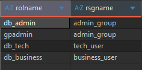
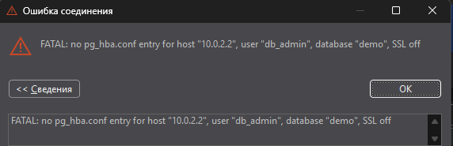
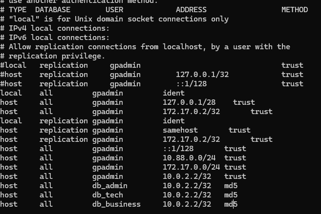
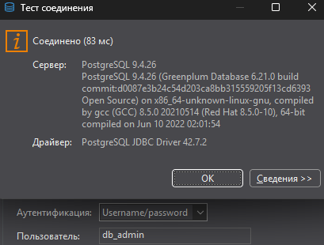
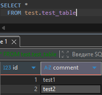

# HW5

## 1. Добавил 2 ресурсные группы к уже существующим 

```sql
CREATE RESOURCE GROUP tech_user WITH (
    CONCURRENCY=10
  , CPU_RATE_LIMIT=30
  , MEMORY_LIMIT=50
  , MEMORY_SHARED_QUOTA=60
  , MEMORY_SPILL_RATIO=40
);


CREATE RESOURCE GROUP business_user WITH (
    CONCURRENCY=20
  , CPU_RATE_LIMIT=20
  , MEMORY_LIMIT=20
  , MEMORY_SHARED_QUOTA=40
  , MEMORY_SPILL_RATIO=20
); 
```
```sql
SELECT * FROM gp_toolkit.gp_resgroup_config grc 
```


---

## 2. Создал пользователей в каждую группу

Выполнил команду:

```sql
CREATE ROLE db_admin WITH
    LOGIN
    ENCRYPTED PASSWORD 'admin'
    SUPERUSER
    RESOURCE GROUP admin_group;

CREATE ROLE db_tech WITH
    LOGIN
    ENCRYPTED PASSWORD 'tech'
    RESOURCE GROUP tech_user;

CREATE ROLE db_business WITH
    LOGIN
    ENCRYPTED PASSWORD 'qwerty'
    RESOURCE GROUP business_user;
```

---

## 3. Проверил распределение пользователей по группам


```sql
SELECT pr.rolname 
     , rg.rsgname
  FROM pg_roles AS pr
  JOIN pg_resgroup AS rg
    ON pr.rolresgroup= rg.oid
```



---

## 4. В dbeaver создал новое подключение под пользователем db_admin. Получил ошибку




---

нужно настроить pg_hba.conf

---


## 5. Подключился к контейнеру, и добавил записи для 3 новых пользователей в pg_hba.conf на мастере



---
Перезапустил GP
```bash
gpstop -a
gpstart -qa
```


## 6. Еще раз попробовал подключиться



---

Запросы выполняются



---
