# HW6

## 1. Проверил, что на данный момент зеркал нет

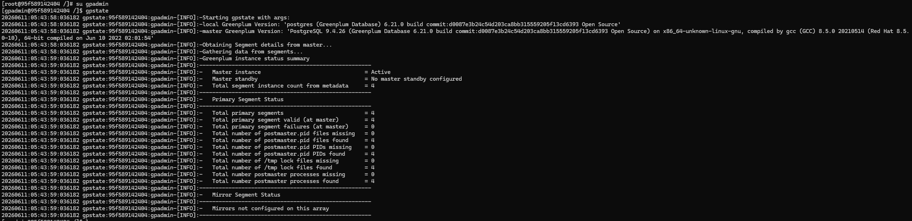
---

## 2. Создал директории для зеркал и выдал права

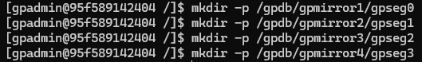
---

Выдавать нужно именно 700, с более обширными правами GP не даст создать зеркала

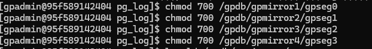
---

## 3. Добавил зеркала для сегментов

Сначала создал конфигурационный файл mirror_cfg командой: 
```bash
gpaddmirrors -o mirror_cfg
```
Содержимое файла:
```bash
0|localhost|7000|/gpdb/gpmirror1/gpseg0
1|localhost|7001|/gpdb/gpmirror2/gpseg1
2|localhost|7002|/gpdb/gpmirror3/gpseg2
3|localhost|7003|/gpdb/gpmirror4/gpseg3
```
После чего выполнил команду:
```bash
gpaddmirrors -i mirror_cfg
```
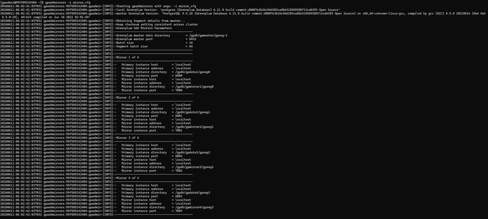

Проверяю что зеркала добавились
```bash
gpstate -m
```
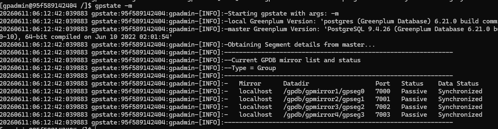
---

## 4. Добавил зеркало для мастера

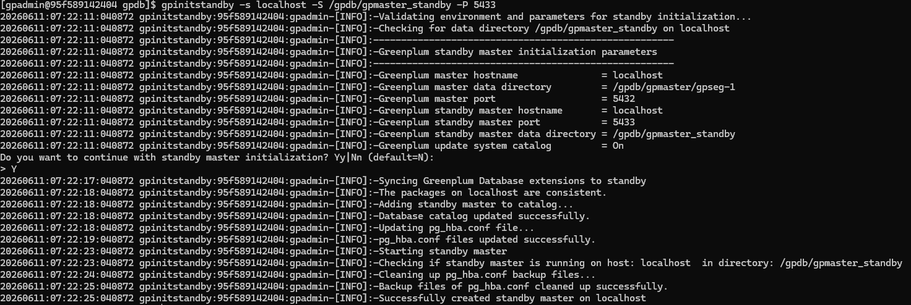

---

## 5. Проверка, наличия зеркал

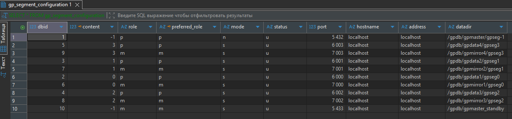

---

## 6. Установил Prometheus, postgres_exporter и Grafana 

Был сделано: 
1. установлен  Prometheus 
2. установлен и запущен как service postgres_exporter
3. добавлен и подключен queries.yaml для собственных запросов к БД
4. установлен Grafana, и добавлены метрики для дашборда

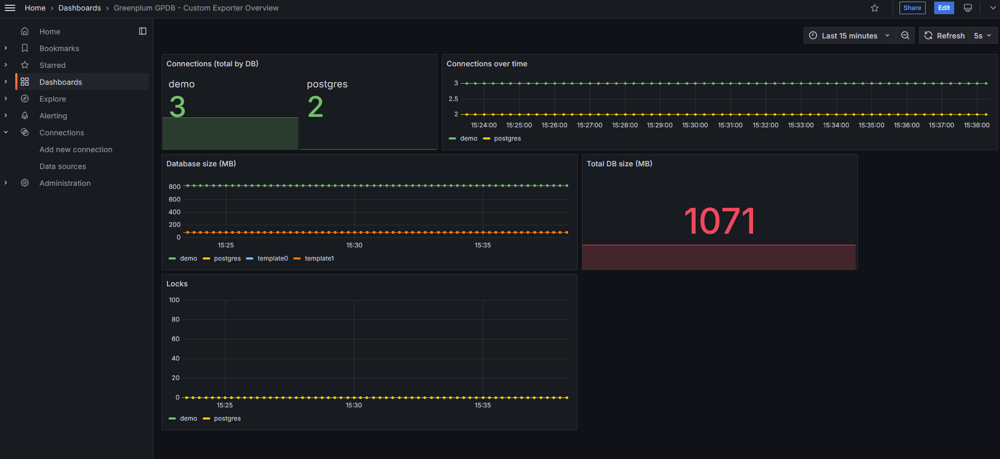
---

## 7. Создал таблицу и проверил кол-во записей на сегментах

```sql
CREATE TABLE test_mirrors (
    id int
) 
DISTRIBUTED BY (id);


INSERT INTO test_mirrors 
SELECT * 
  FROM GENERATE_SERIES(1,100000);
  
  
SELECT gp_segment_id
     , COUNT(*) 
  FROM test_mirrors
 GROUP BY gp_segment_id;
```
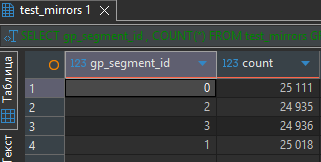
---

## 8. Остановил сегмент 

Остановил сегмент командой:

```bash
pg_ctl stop -m fast -D /gpdb/gpdata1/gpseg0/
```
Проверил, что зеркало теперь работает как основной сегмент
dbid = 2 остановлен, dbid = 6 работает как основной

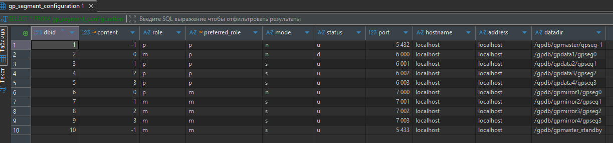

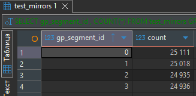

---

## 9. Восстановил сегмент

Восстановил сегмент командой:

```bash
pg_ctl start -D /gpdb/gpdata1/gpseg0/
```

Выполнил восстановление сегмента

```bash
gprecoverseg -r
```

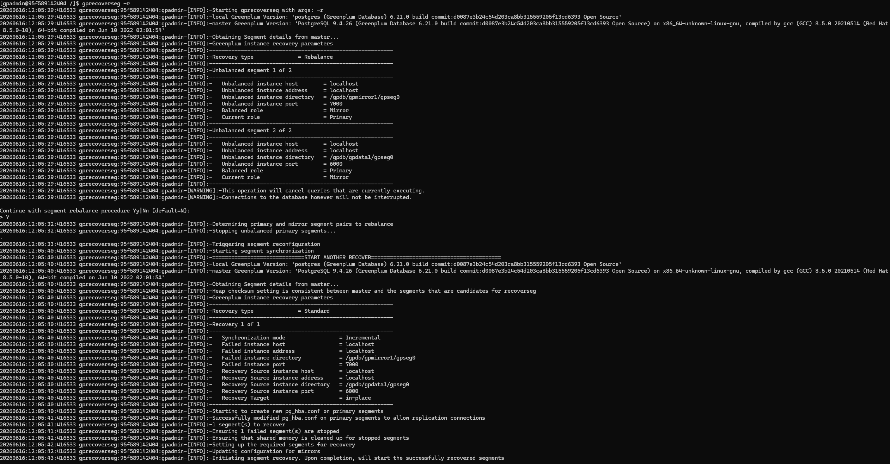


