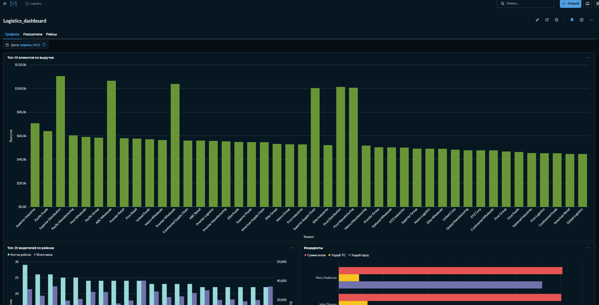
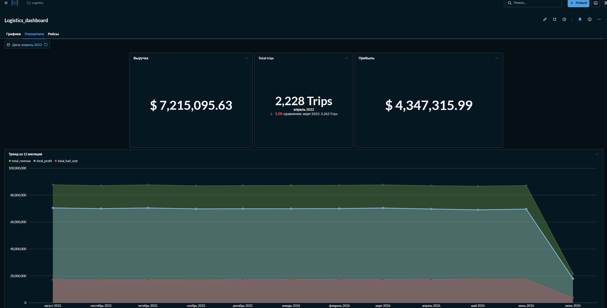
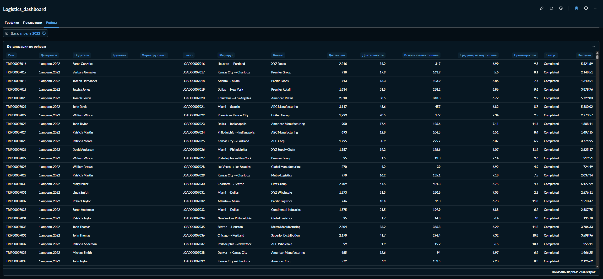

### 1) Развертывание инфраструктуры
#### Greenplum

Был выбран образ сразу с pxf: https://github.com/woblerr/docker-greenplum:
```bash
docker run -d  --name greenplum-pxf -p 5432:5432  -e GREENPLUM_DATABASE_NAME=logistics -e GREENPLUM_PASSWORD=_GP_PASS -e GREENPLUM_PXF_ENABLE=true  woblerr/greenplum:6.27.1
```

Создана сеть 
```bash
docker network create logistics-net
```
Подключен Greenplum
```bash
docker network connect logistics-net greenplum-pxf
```

#### Airflow
Скачал официальный compose Airflow 2.10
```bash
curl -LfO https://airflow.apache.org/docs/apache-airflow/2.10.0/docker-compose.yaml
```

Были внесены изменения:
```txt
AIRFLOW__CORE__EXECUTOR: LocalExecutor
AIRFLOW__CELERY__RESULT_BACKEND - удален
AIRFLOW__CELERY__BROKER_URL - удален
```
(По умолчанию был CeleryExecutor, поменял т.к у меня весь проект на одном сервере, а Celery используется для распределённых систем. Так же удалил сервисы связанные с Celery)
```txt
AIRFLOW__SCHEDULER__DAG_DIR_LIST_INTERVAL: "60"
AIRFLOW__CORE__MIN_FILE_PROCESS_INTERVAL: "30"
AIRFLOW__SCHEDULER__PARSING_PROCESSES: "1"
```
(Для снижения нагрузки на сервер)
```txt
AIRFLOW__CORE__LOAD_EXAMPLES: "false"
```
(Исключил демонстрационные даги)


#### PostgreSQL, Metabase, Prometheus, Postgres Exporter, Grafana
Добавил дополнительный **docker-compose.override.yml**

### 2) Создал схемы и модель данных для схем:
**ext** - внешние таблицы. Используется PXF.  
Модель хранится в **dags/utils/ext_diff_templates.py**

**stg** - таблицы копии источника с дополнительными полями **load_date, source_name, batch_id**.  
Все таблицы **WITH (appendonly=true, orientation=column, compresstype=zstd, compresslevel=2)**

**dds** - Хранилище  
Все таблицы **WITH (appendonly=true, orientation=column, compresstype=zstd, compresslevel=2)**  
Партицированные сателиты:

**dds.sat_delivery_event_details  
dds.sat_fuel_purchase_details  
dds.sat_incident_details  
dds.sat_load_details  
dds.sat_maintenance_details  
dds.sat_trip_details**  

Интервал 1 месяц

**dm** - Витрины.  
Все таблицы партицированы, интервал 1 месяц.  
**DISTRIBUTED RANDOMLY** - т.к это конечные витрины

 dm.dm_driver_performance - Оценка эффективности водителей   
dm.dm_delivery_performance - Оценка качества доставок по маршрутам  
 dm.dm_customer_analysis - Анализ клиентов  
dm.dm_truck_utilization - Использование грузовиков  
 dm.dm_trip_facts - Детальные факты по каждому рейсу  
 dm.dm_safety_summary - Данные по инцидентам  
dm.dm_route_profitability - Рентабельность маршрутов  
 dm.dm_fleet_kpi - Агрегированные KPI по всему парку  

**meta** - метаданные для загрузки. Маппинги, номера и время батчей.

Созданы роли для airflow и metabase

### 3) Создал модель данных для PG-источника. 
Модель таблиц в **db_pg\model\public**  
Прогрузил данные в источник. и создал генератор данных. Запускаю генератор каждые 10 минут с помощью дага **source_generate_dag.py.**

### 4) Созданы функции расчета витрин. 
Предварительный транкейт партиции и расчет.  
Т.к в dds производится только вставка, то всегда вычисляется самая актальная строка по load_date. Так же исключаются строки попавшие в sts-таблицы с флагом is_deleted  
В процессе расчета создаются временные таблицы, для смены ключа дистрибуции, если это необходимо.

### 5) Подключение pxf 
В контенере Greenplum, в data/pxf/servers/ создана директория pgsrc, и в неё добавлен файл с конфикурацией профиля jdbc-site.xml.  
В data/pxf/lib/ добавлен jdbc драйвер для postgres.
После чего из под gpadmin синхронизировал настройки и перезапустил службу pxf.
```bash
pxf cluster sync
pxf cluster restart
```

### 6) Реализация загрузки 
Процессом загрузки от источника до витрин управляет даг **dwh_pipeline** и утилиты **dv_loader, ext_diff, marts**.  
Даг стартует каждый час **schedule=timedelta(hours=1)**  
	1. Создается новая запись в **meta.load_batches** с новым номером батча.  
	2. **load_stage**  
     Выполняется загрузка из внешних таблиц в stage.   
     В даге есть **STAGE_SOURCES** - список таблиц источника и их соответствие в stg. Цикл проходит по всем записям в **STAGE_SOURCES** и формирует INSERT в stg-таблицу, собираю информацию о временной метке последнего батча, временной метке нового батча и списке полей таблицы. 
     Формируется запрос c условием:
```sql
updated_at > {Временная метка последнего батча} AND updated_at <= {Временная метка нового батча}
```
   3. **detect_changed_months**  
   Генератор создает/меняет данные в источнике на глубину до 60 дней. Поэтому, для актуализации витрин, нужно знать, за какие месяца пришли изменения.   Данная таска собирает информацию о датах изменений в последнем загруженном в stg батче. Для факт-таблиц это бизнес-даты, для измерений даты загрузки. Формируется список из первых дат месяца.  
   4. **load_hubs**  
   Загрузка в хабы.  
   Из **meta.dv_mappings** собирается информация о полях таблицы и наименованиях таблицы источника и целевой таблицы. Из stg-таблицы собираются записи из последнего батча, и проверяется, есть ли уже такая запись в хабе. Если нет, то запись добавляется в хаб.
   5. **load_links**
   Загрузка в линки
   Из **meta.dv_mappings** собирается информация о ключах в источнике и их порядке, для хэш-ключа линка.
   Вичисляются ключи и сравниваются с уже существующими в линке. Если записи нет, то загружается.
   6. **load_sats** 
   Загрузка в сателлиты
   Из **meta.dv_mappings** собирается информация об аттрибутах, вычисляется их хэш(hash_diff) и хэш-ключ.
   Данные добавляются, либо если в линке нет такого ключа, либо если ключ есть, но отличается hash_diff.
   7. **load_sts**  
   Загрузка в Status Tracking Satellite
   Т.к в источнике есть поле is_deleted(помечен на удаление), то необходимо учитывать удаленные строки при построении витрин.  
   Загрузка аналогична сателлитам, только сравнивается не hash_diff, а поле is_deleted.
   8. **fill_marts**
   Получаю список месяцев, за которые нужно посчитать витрины, формирую для каждой даты, дату конца месяца и запускаю расчет витрин в цикле. Список витрин хранится в utils.marts.
   9. **end**  
   Обновляются записи в meta-таблицах.

### 7) Metabase
Созданы графики и отчеты
	




 

